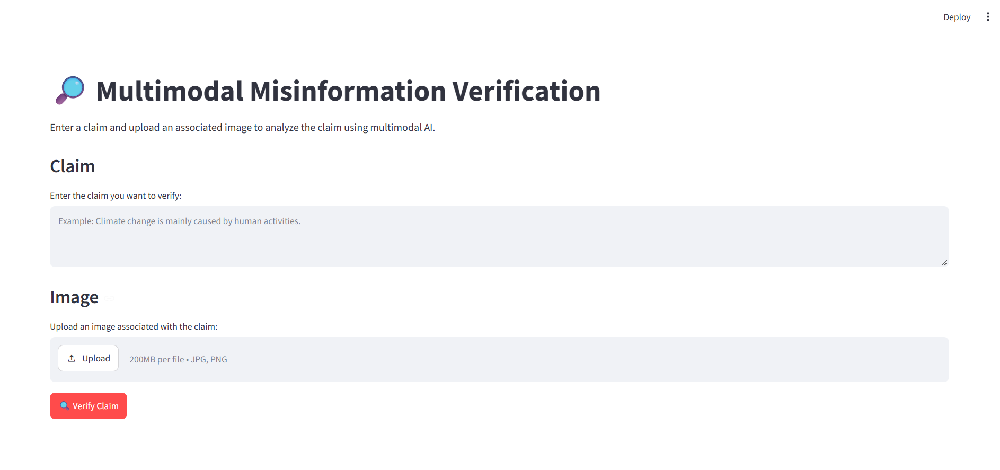
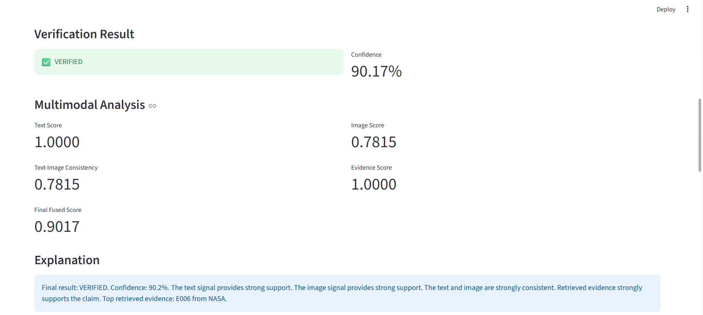
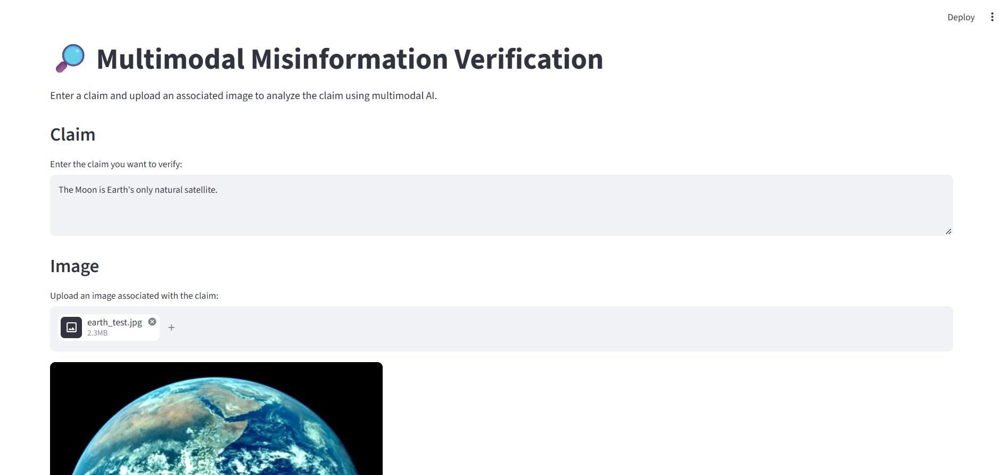
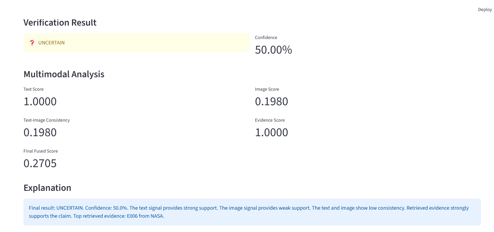
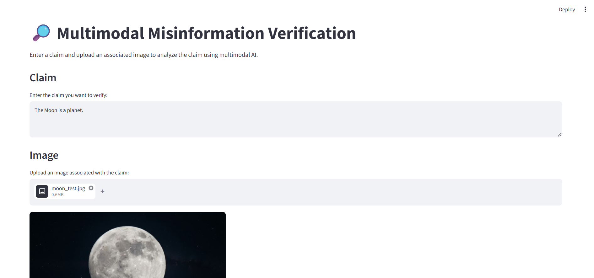
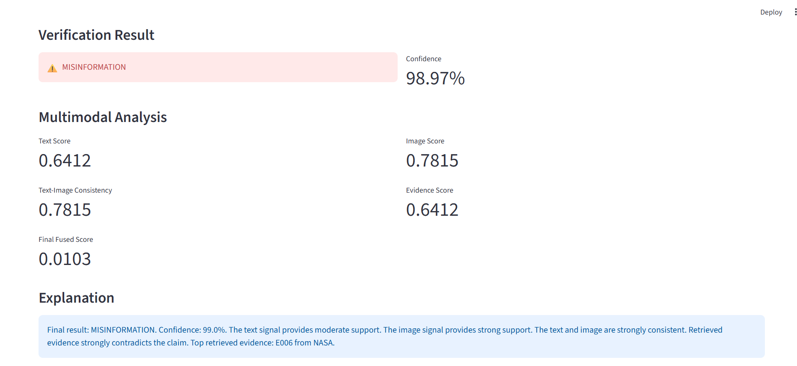
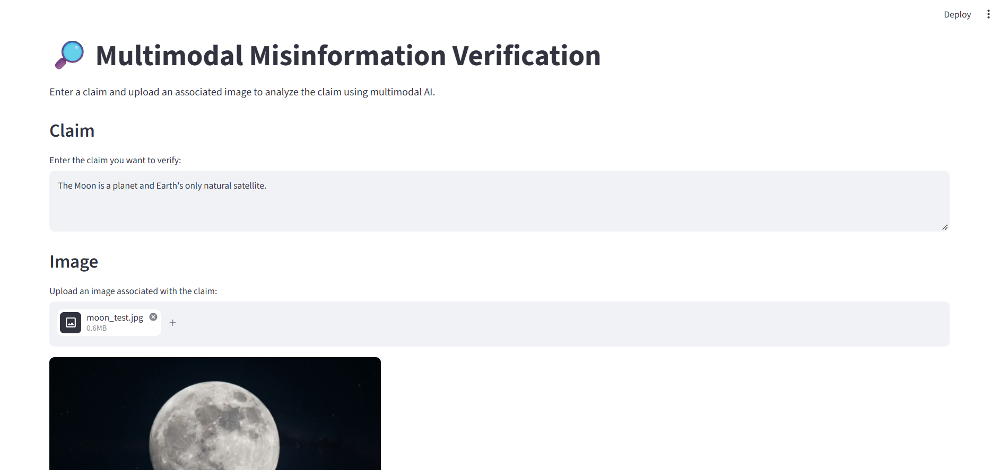
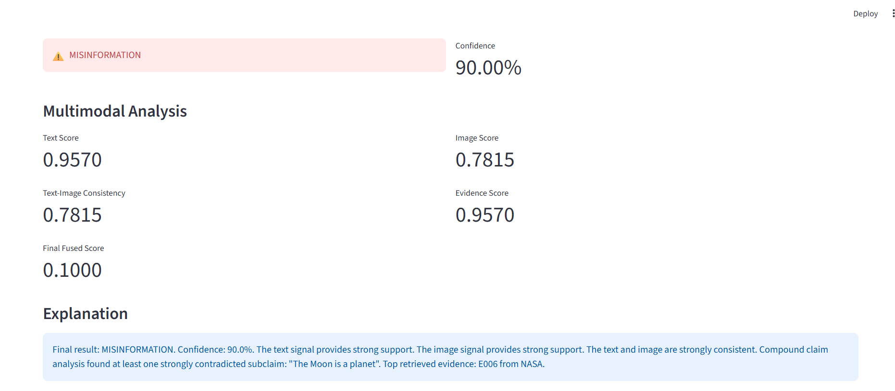

# MULTIMODAL MISINFORMATION VERIFICATION

## Using Text, Image Consistency and Evidence Retrieval


### Final Project Report


\*\*Degree:\*\* Bachelor of Science in Artificial Intelligence  

\*\*Year:\*\* Third Year  

\*\*Semester:\*\* Semester 5  


\---


# Abstract


Misinformation is increasingly distributed through digital platforms using a combination of text and images. A system that examines only the textual part of a claim may miss important visual inconsistencies, while an image-only system may not have enough information to determine whether a statement is factually correct.


This project presents a multimodal misinformation verification system that combines text analysis, image analysis, text-image consistency checking, evidence retrieval, Natural Language Inference (NLI), multimodal fusion, confidence-aware decision making, and explanation generation.


The system accepts a textual claim and an associated image. The textual claim is encoded using a transformer-based text model, while the image is processed using an OpenCLIP/ViT-B-32 image encoder. Relevant factual evidence is retrieved from a curated evidence knowledge base using semantic embeddings and FAISS vector search. An NLI component determines whether retrieved evidence supports or contradicts the claim. Visual topic analysis is used to determine whether the image is consistent with the claim.


The outputs of these components are combined through a multimodal verification pipeline. The final result is classified as VERIFIED, MISINFORMATION, or UNCERTAIN. The system also provides confidence information, retrieved evidence, source citations, visual consistency information, and a human-readable explanation.


The controlled evaluation achieved 86.67% accuracy and 87.50% Macro F1 on a 15-case validation dataset. A separate 20-case realistic multimodal validation achieved 100% accuracy and 100% Macro F1. Baseline comparison showed that the full multimodal configuration substantially outperformed evidence-only and image-only configurations on the controlled dataset.


The project demonstrates how multiple AI signals can be combined to create an explainable and evidence-based multimodal misinformation verification prototype.


\---


# 1. Introduction


## 1.1 Background


The rapid growth of social media, online news, messaging platforms, and digital content has made the spread of misinformation easier. False or misleading information can contain both textual statements and images, and the two modalities may not always agree.


For example, a factual statement may be paired with an unrelated image, or a false statement may be presented with an image that appears relevant. Therefore, reliable verification requires more than simple text classification.


Multimodal Artificial Intelligence provides an approach in which information from multiple data types can be analyzed together.


This project focuses on combining textual evidence, visual information, and external factual evidence to support misinformation verification.


## 1.2 Problem Statement


Traditional misinformation detection systems often focus primarily on textual content. Such systems may fail when:


\- The image contradicts the text.

\- The image is unrelated to the claim.

\- The claim contains multiple factual statements.

\- Strong external evidence is required.

\- There is insufficient evidence for a binary decision.


The problem addressed by this project is:


\*\*How can a multimodal AI system combine text, images, retrieved evidence, and semantic reasoning to provide an explainable and confidence-aware misinformation verification result?\*\*


## 1.3 Motivation


The main motivation is to develop a practical AI system that does not simply predict whether a piece of text is true or false.


The system should instead:


1\. Understand the textual claim.

2\. Analyze the associated image.

3\. Check whether the image is visually consistent with the claim.

4\. Retrieve relevant factual evidence.

5\. Determine whether the evidence supports or contradicts the claim.

6\. Combine the available signals.

7\. Report uncertainty when evidence is insufficient.

8\. Explain the reason behind the final decision.


## 1.4 Objectives


The main objectives are:


\- Develop a multimodal misinformation verification system.

\- Process both textual and visual information.

\- Generate text and image embeddings.

\- Retrieve relevant factual evidence.

\- Use NLI to determine evidence stance.

\- Detect image-text inconsistencies.

\- Handle compound claims.

\- Combine multimodal signals using fusion.

\- Provide confidence-aware verification.

\- Provide source citations.

\- Generate understandable explanations.

\- Evaluate the system using appropriate metrics.

\- Compare the multimodal system with simpler baselines.

\- Perform modality ablation.

\- Analyze failures and limitations.

\- Provide a reproducible academic prototype.


## 1.5 Scope


The project focuses on an academic prototype for multimodal misinformation verification.


The scope includes:


\- Text claim processing

\- Image processing

\- Evidence retrieval

\- Visual consistency analysis

\- NLI-based evidence analysis

\- Multimodal fusion

\- Confidence-aware classification

\- Explanation generation

\- Controlled validation

\- Realistic validation

\- Robustness testing

\- Failure analysis

\- Streamlit-based demonstration


The system is not intended to replace professional fact-checkers or provide guaranteed real-world truth detection.


## 1.6 Expected Outcome


The expected outcome is an end-to-end application where a user can provide a claim and image and receive:


\- Verification result

\- Confidence score

\- Relevant evidence

\- Evidence source

\- Evidence stance

\- Image-text consistency

\- Explanation


The system should also demonstrate that multimodal signals can improve verification compared with using only one information source.


\---


# 2. Industry Problem and Stakeholders


## 2.1 Industry Problem


Online misinformation creates challenges for:


\- Social media platforms

\- News organizations

\- Fact-checking organizations

\- Educational institutions

\- Researchers

\- General internet users


Manual verification can require significant time and effort, especially when claims contain multiple pieces of information or are associated with misleading images.


An AI-assisted verification system can help organize evidence and highlight possible inconsistencies.


## 2.2 Stakeholders


| Stakeholder | Interest |

|---|---|

| General users | Quick and understandable verification |

| Fact-checkers | Evidence and source support |

| Journalists | Faster claim investigation |

| Researchers | Multimodal misinformation analysis |

| Educational institutions | Demonstration of AI techniques |

| System administrators | Reliable operation and maintenance |


## 2.3 User Stories


### User Story 1


As a user, I want to enter a claim and image so that I can receive a verification result.


### User Story 2


As a user, I want to see the evidence used by the system so that I can understand the decision.


### User Story 3


As a user, I want source citations so that I can independently inspect the evidence.


### User Story 4


As a user, I want the system to identify image-text mismatch so that misleading images can be detected.


### User Story 5


As a user, I want an UNCERTAIN result when evidence is insufficient rather than receiving an unsupported answer.


### User Story 6


As an administrator, I want automated tests so that system changes can be checked before release.


## 2.4 Misuse Cases


Potential misuse includes:


\- Treating an AI prediction as guaranteed truth.

\- Using the system as the only source for important decisions.

\- Interpreting confidence as absolute probability.

\- Providing sensitive personal information unnecessarily.

\- Using unsupported topics and assuming the system has complete evidence coverage.


The system documentation explicitly identifies these limitations.


\---


# 3. Existing Approach and Proposed Solution


## 3.1 Limitations of a Text-Only Approach


A text-only misinformation detector may identify linguistic patterns but does not directly consider whether an associated image matches the claim.


For example, a true textual claim paired with an unrelated image may still appear trustworthy to a text-only system.


## 3.2 Limitations of an Image-Only Approach


An image alone generally cannot determine whether a factual statement is true.


An image may show a relevant object while providing no reliable factual evidence for the claim.


## 3.3 Proposed Multimodal Approach


The proposed system combines:


\*\*Text + Image + Evidence Retrieval + NLI + Visual Consistency + Multimodal Fusion + Explanation\*\*


The combination allows the system to consider both the factual evidence and the visual context.


## 3.4 Main Advantages


The proposed system provides:


\- Multimodal analysis

\- Evidence-based verification

\- Source traceability

\- Visual consistency checking

\- Compound claim handling

\- Confidence-aware decisions

\- Uncertainty handling

\- Explainable output

\- Automated testing

\- Reproducible evaluation


# 4. System Architecture and Technical Methodology


## 4.1 System Architecture


The system follows a modular multimodal verification architecture.


The major components are:


1\. Streamlit User Interface

2\. Claim Preparation

3\. Text Encoder

4\. Image Encoder

5\. Visual Topic Analyzer

6\. Visual Consistency Checker

7\. Claim Decomposer

8\. Evidence Knowledge Base

9\. Evidence Encoder

10\. FAISS Evidence Retriever

11\. NLI Stance Analyzer

12\. Multimodal Fusion

13\. Verification Engine

14\. Explanation Generator


The overall processing flow is:


```text

User Claim + Image

&#x20;       |

&#x20;       v

+----------------------+

| Streamlit Interface  |

+----------+-----------+

&#x20;          |

&#x20;          v

+----------------------+

| Claim Preparation    |

+----------+-----------+

&#x20;          |

&#x20;    +-----+-----+

&#x20;    |           |

&#x20;    v           v

+---------+   +----------------+

|  Text   |   |     Image      |

| Encoder |   |    Encoder     |

+----+----+   +-------+--------+

&#x20;    |                |

&#x20;    v                v

Text Embedding   Image Embedding

&#x20;    |                |

&#x20;    |                v

&#x20;    |        +------------------+

&#x20;    |        | Visual Topic     |

&#x20;    |        | Analysis         |

&#x20;    |        +--------+---------+

&#x20;    |                 |

&#x20;    |                 v

&#x20;    |        +------------------+

&#x20;    |        | Visual           |

&#x20;    |        | Consistency      |

&#x20;    |        +--------+---------+

&#x20;    |                 |

&#x20;    +--------+--------+

&#x20;             |

&#x20;             v

&#x20;     +-------------------+

&#x20;     | Claim Decomposer  |

&#x20;     +---------+---------+

&#x20;               |

&#x20;               v

&#x20;     +-------------------+

&#x20;     | Evidence Encoder  |

&#x20;     +---------+---------+

&#x20;               |

&#x20;               v

&#x20;     +-------------------+

&#x20;     | FAISS Retriever   |

&#x20;     +---------+---------+

&#x20;               |

&#x20;               v

&#x20;     +-------------------+

&#x20;     | NLI Stance        |

&#x20;     | Analyzer          |

&#x20;     +---------+---------+

&#x20;               |

&#x20;               v

&#x20;     +-------------------+

&#x20;     | Multimodal Fusion |

&#x20;     +---------+---------+

&#x20;               |

&#x20;               v

&#x20;     +-------------------+

&#x20;     | Verification      |

&#x20;     +---------+---------+

&#x20;               |

&#x20;               v

&#x20;     +-------------------+

&#x20;     | Explanation       |

&#x20;     +---------+---------+

&#x20;               |

&#x20;               v

&#x20;      Final Result + Evidence


## 4.2 User Interface


The project uses Streamlit as the web application interface.


The interface allows the user to provide:


\- A textual claim

\- An associated image


The result page presents the verification output and supporting information.


The interface is designed to keep the verification process simple so that users can submit a claim and image without needing technical knowledge.

### Figure 1 — Streamlit User Interface



*Figure 1: Main Streamlit interface for entering a claim and uploading an associated image.*


## 4.3 Text Processing


The textual claim is first prepared and normalized before being passed to the verification pipeline.


The system uses a transformer-based text encoder to generate a semantic representation of the claim.


### Text Model


The project uses:


`distilbert-base-uncased`


The text encoder converts the claim into a numerical representation that can be used by downstream verification components.


Text processing is important because the system must understand the meaning of the claim rather than relying only on individual keywords.


The processed claim is also used during evidence retrieval, NLI analysis, and compound claim evaluation.


## 4.4 Image Processing


The associated image is processed using an OpenCLIP-based image encoder with a ViT-B-32 architecture.


The image encoder converts the input image into a numerical visual representation.


The system also performs zero-shot visual topic analysis to identify the general subject of the image.


The current validation includes visual topics such as:


\- Earth

\- Moon

\- Boiling water

\- Red sports car

\- Industrial pollution


The detected visual topic is used together with the textual claim to determine whether the image is visually consistent with the claim.


Image processing therefore provides an additional verification signal that cannot be obtained from text analysis alone.


## 4.5 Text-Image Consistency


The system checks whether the visual content of an image is consistent with the subject described by the textual claim.


First, the expected visual topic is identified from the claim. The image is then analyzed to determine its detected visual topic.


The system compares the expected and detected topics and produces one of three general outcomes:


\- Consistent

\- Inconsistent

\- Unknown or ambiguous


A visual mismatch does not automatically prove that the textual claim is false. Instead, it acts as an additional signal during the final verification process.


This approach helps identify cases where an otherwise plausible textual claim is paired with an unrelated or misleading image.


## 4.6 Claim Decomposition


A single user input may contain multiple factual statements.


The claim decomposition component identifies compound claims and separates them into individual subclaims.


For example:


The Moon is a planet and it is Earth's only natural satellite.


can be evaluated as separate statements:


1\. The Moon is a planet.

2\. The Moon is Earth's only natural satellite.


Each subclaim can then be evaluated independently using evidence retrieval and NLI analysis.


This prevents a supported statement from hiding another statement that is strongly contradicted by available evidence.


The final decision for a compound claim considers the results of the individual subclaims.


## 4.7 Evidence Knowledge Base


The system maintains a curated evidence knowledge base for factual verification.


The evidence knowledge base is stored in:


`data/evidence/evidence.csv`


Each evidence record contains:


\- Evidence identifier

\- Evidence text

\- Source organization

\- Public source URL


The knowledge base contains factual information obtained from reliable public sources such as NASA, WHO, NIST, NOAA, UNESCO, IBM, and Britannica.


The evidence knowledge base allows the system to provide traceable supporting information instead of producing a verification result without evidence.


## 4.8 Semantic Evidence Retrieval


The evidence statements are converted into numerical embeddings using a Sentence Transformer model.


The system uses FAISS for efficient vector similarity search.


When a user submits a claim, the claim is represented semantically and compared with the evidence embeddings.


The most relevant evidence records are retrieved based on semantic similarity.


The retrieved evidence is then passed to the Natural Language Inference component for further analysis.


This approach allows the system to retrieve evidence based on meaning rather than requiring an exact keyword match.


## 4.9 Natural Language Inference


Natural Language Inference (NLI) is used to determine the relationship between the user's claim and the retrieved evidence.


The NLI component evaluates whether the evidence:


\- Supports the claim

\- Contradicts the claim

\- Does not provide sufficient information


The main evidence stances used by the system are:


`SUPPORTS`


`CONTRADICTS`


`NEUTRAL/INSUFFICIENT`


Strongly contradictory evidence is given significant importance during the final verification process.


This component adds semantic reasoning to the evidence retrieval stage and helps distinguish relevant evidence from evidence that directly supports or contradicts the claim.


## 4.10 Multimodal Fusion


The multimodal fusion stage combines information obtained from different parts of the verification pipeline.


The main signals considered are:


\- Retrieved evidence

\- Evidence stance

\- Visual consistency

\- Compound claim evaluation


These signals are combined to produce an overall verification signal.


The purpose of multimodal fusion is to avoid depending entirely on a single source of information.


For example, a claim may have supporting textual evidence but an unrelated image. In such a case, the visual consistency signal can influence the final decision toward `UNCERTAIN`.


Similarly, strong contradictory evidence can have greater influence than weak supporting evidence.


## 4.11 Verification Logic


The verification engine combines the available signals and assigns one of three final labels.


### VERIFIED


The claim is classified as `VERIFIED` when available evidence provides strong support and there is no significant visual contradiction.


### MISINFORMATION


The claim is classified as `MISINFORMATION` when strong evidence contradicts the claim.


### UNCERTAIN


The claim is classified as `UNCERTAIN` when the available evidence is insufficient, ambiguous, or when significant visual inconsistency prevents a reliable conclusion.


The three-class decision approach is useful because real-world misinformation verification cannot always provide a reliable binary true-or-false answer.


## 4.12 Contradiction Handling


Strong contradictory evidence is given significant importance in the verification process.


When reliable evidence directly contradicts a claim, the contradiction can override weaker supporting signals.


This is important because a claim may retrieve several generally related pieces of evidence while also having one strong piece of evidence that directly disproves it.


The system also applies contradiction handling to compound claims.


If one subclaim is strongly contradicted while another subclaim is supported, the system does not ignore the contradiction. Instead, the compound claim evaluation considers the result of each independently evaluated subclaim.


This improves the handling of complex claims containing multiple factual statements.


## 4.13 Confidence-Aware Output


The system produces a confidence score together with the final verification label.


The confidence score represents the strength of the current system decision based on the available verification signals.


It is not presented as a guaranteed probability of truth.


The system can return an `UNCERTAIN` result when the available information is insufficient or ambiguous instead of producing an unsupported high-confidence decision.


Confidence information helps users understand how strongly the system supports its current result.


## 4.14 Explanation Generation


The explanation component generates a human-readable summary of the verification process.


The explanation can refer to:


\- Retrieved evidence

\- Evidence stance

\- Visual consistency

\- Compound claim results

\- Contradiction handling

\- Final confidence


This makes the verification process more transparent and easier for users to understand.


The explanation is designed to support the final prediction rather than simply presenting a classification label without reasoning.


# 5. Sequence and Data Flow


## 5.1 Main Verification Sequence


The complete verification process follows the sequence below:


```text

User

&#x20;|

&#x20;| Claim + Image

&#x20;v

Streamlit UI

&#x20;|

&#x20;v

Claim Preparation

&#x20;|

&#x20;+--------------------+

&#x20;|                    |

&#x20;v                    v

Text Encoder      Image Encoder

&#x20;|                    |

&#x20;v                    v

Text Features    Image Features

&#x20;|                    |

&#x20;|              Visual Analysis

&#x20;|                    |

&#x20;+---------+----------+

&#x20;          |

&#x20;          v

Visual Consistency

&#x20;          |

&#x20;          v

Claim Decomposition

&#x20;          |

&#x20;          v

Evidence Encoding

&#x20;          |

&#x20;          v

FAISS Retrieval

&#x20;          |

&#x20;          v

NLI Stance Analysis

&#x20;          |

&#x20;          v

Multimodal Fusion

&#x20;          |

&#x20;          v

Verification

&#x20;          |

&#x20;          v

Explanation

&#x20;          |

&#x20;          v

Streamlit Result


## 5.2 Evidence Retrieval Flow


The evidence retrieval process follows these steps:


```text

Claim

&#x20; |

&#x20; v

Claim Embedding

&#x20; |

&#x20; v

FAISS Similarity Search

&#x20; |

&#x20; v

Top-k Evidence

&#x20; |

&#x20; v

NLI Comparison

&#x20; |

&#x20; v

Support / Contradiction / Insufficient


The claim is converted into a semantic representation and compared with the evidence embeddings stored in the knowledge base.


The most relevant evidence records are retrieved and analyzed using Natural Language Inference.


## 5.3 Visual Consistency Flow


The visual consistency process follows:


```text

Claim

&#x20;|

&#x20;v

Expected Visual Topic

&#x20;|

&#x20;+------------------+

&#x20;                   |

Image               |

&#x20;|                  |

&#x20;v                  |

OpenCLIP            |

&#x20;|                  |

&#x20;v                  |

Detected Topic -----+

&#x20;|

&#x20;v

Consistency Result


The expected visual topic is inferred from the claim and compared with the visual topic detected from the image.


The resulting consistency signal is passed to the multimodal decision process.


## 5.4 Compound Claim Flow


Compound claims are processed using the following sequence:


```text

Compound Claim

&#x20;     |

&#x20;     v

Claim Decomposer

&#x20;     |

&#x20;     +--------+--------+

&#x20;     |                 |

&#x20;     v                 v

Subclaim 1          Subclaim 2

&#x20;     |                 |

&#x20;     v                 v

Evidence/NLI       Evidence/NLI

&#x20;     |                 |

&#x20;     +--------+--------+

&#x20;              |

&#x20;              v

&#x20;      Compound Decision


Each subclaim is evaluated independently before the results are combined.


This allows the system to identify cases where different parts of the same claim have different evidence.


# 6. Database and Feature Schema


## 6.1 Evidence Storage


The project uses CSV-based storage for the evidence knowledge base.


The main evidence file is:


`data/evidence/evidence.csv`


The schema is:


| Field | Purpose |

|---|---|

| evidence\_id | Unique identifier for the evidence record |

| text | Factual evidence statement |

| source | Organization providing the evidence |

| url | Public source citation |


The CSV approach is suitable for the academic prototype because the evidence dataset is relatively small and easy to inspect, update, and reproduce.


## 6.2 Feature Signals


The verification pipeline uses multiple signals during decision making.


| Signal | Purpose |

|---|---|

| Text representation | Represents the semantic meaning of the claim |

| Image representation | Represents the visual information |

| Visual topic | Identifies the broad subject of the image |

| Consistency score | Measures compatibility between claim and image |

| Retrieved evidence | Provides relevant factual information |

| NLI stance | Determines support or contradiction |

| Fusion score | Combines verification signals |

| Confidence | Represents strength of the final decision |


These signals allow the system to perform multimodal verification rather than depending only on text classification.


# 7. API and Component Contract


## 7.1 Verification Function


The main verification pipeline conceptually exposes the following function:


```text

verify(claim, image\_path, top\_k)

### Inputs


| Parameter | Description |

|---|---|

| claim | Textual claim provided by the user |

| image\_path | Path to the associated image |

| top\_k | Number of evidence records to retrieve |


### Outputs


The verification pipeline returns information including:


\- Final verification label

\- Confidence score

\- Retrieved evidence

\- Evidence source

\- Evidence stance

\- Visual consistency

\- Explanation

\- Compound claim results where applicable


## 7.2 Component Responsibilities


Each major component has a specific responsibility.


| Component | Responsibility |

|---|---|

| Streamlit UI | Collects user input and displays results |

| Text Encoder | Generates text representation |

| Image Encoder | Generates image representation |

| Visual Topic Analyzer | Identifies broad visual topic |

| Visual Consistency Checker | Compares image topic with claim topic |

| Claim Decomposer | Separates compound claims |

| Evidence Encoder | Generates evidence embeddings |

| FAISS Retriever | Retrieves relevant evidence |

| NLI Analyzer | Determines evidence stance |

| Multimodal Fusion | Combines verification signals |

| Verifier | Produces final classification |

| Explanation Generator | Produces understandable reasoning |


# 8. Technology Stack


The project uses the following technologies and tools:


| Technology | Purpose |

|---|---|

| Python 3.11 | Main programming language |

| Streamlit | Web application interface |

| PyTorch | Deep learning framework |

| Transformers | Transformer-based NLP processing |

| DistilBERT | Text representation |

| OpenCLIP | Image representation and visual analysis |

| ViT-B-32 | Image encoder architecture |

| Sentence Transformers | Semantic evidence embeddings |

| FAISS | Vector similarity retrieval |

| Natural Language Inference | Evidence stance analysis |

| Scikit-learn | Evaluation and performance metrics |

| OpenCV | Image processing |

| Git | Version control |

| GitHub Actions | Continuous integration |


## 8.1 Why These Technologies Were Selected


Python was selected because it provides a strong ecosystem for Artificial Intelligence, Natural Language Processing, computer vision, and machine learning.


Streamlit was selected because it allows the multimodal verification system to be demonstrated through a simple web interface.


Transformer-based models were selected to provide semantic representations for textual information.


OpenCLIP and ViT-B-32 were selected for visual representation and zero-shot image topic analysis.


Sentence Transformers and FAISS were selected to support semantic evidence retrieval.


NLI was included to determine whether retrieved evidence supports or contradicts the claim.


Scikit-learn was used for evaluation metrics and analysis.


Git and GitHub Actions provide version control and automated testing support.


## 8.2 Overall Technical Approach


The technical approach combines several AI capabilities into one verification pipeline.


Instead of depending on a single classification model, the system uses multiple complementary signals.


The overall approach can be summarized as:


```text

Text Understanding

&#x20;      +

Image Understanding

&#x20;      +

Text-Image Consistency

&#x20;      +

Evidence Retrieval

&#x20;      +

Natural Language Inference

&#x20;      +

Multimodal Fusion

&#x20;      +

Confidence-Aware Decision

&#x20;      +

Explanation

&#x20;      =

Multimodal Misinformation Verification


This architecture demonstrates the use of multiple Artificial Intelligence techniques within a single practical application.


# 9. AI/ML Models and Implementation


The proposed system combines multiple Artificial Intelligence and Natural Language Processing techniques to verify potentially misleading information using text, images, evidence retrieval, and multimodal reasoning.


Instead of depending on a single classification model, the system uses multiple components that contribute different types of information to the final verification decision.


The main AI components are:


\* Transformer-based text representation using DistilBERT

\* Image representation using OpenCLIP with ViT-B-32

\* Zero-shot visual topic analysis

\* Text-image consistency analysis

\* Compound claim decomposition

\* Semantic evidence embedding

\* FAISS-based evidence retrieval

\* Natural Language Inference for evidence stance

\* Multimodal signal fusion

\* Confidence-aware verification

\* Explanation generation


The complete implementation connects these components into a single end-to-end verification pipeline.


## 9.1 Text Processing and Text Encoder


The text processing component prepares the user-provided claim before it is passed to the verification pipeline.


The system accepts a textual claim as the main input. Basic processing is performed to clean and standardize the claim while preserving its semantic meaning.


The processed claim is then converted into a numerical representation using a transformer-based text encoder.


The project uses DistilBERT for text representation. DistilBERT is a lightweight transformer model that can capture contextual relationships between words in a sentence.


The text encoder converts the input claim into a dense vector representation. This representation is used by later components of the system for semantic analysis and verification.


The general process is:


```text

User Claim

&#x20;   ↓

Text Processing

&#x20;   ↓

DistilBERT Text Encoder

&#x20;   ↓

Contextual Text Representation

&#x20;   ↓

Verification Pipeline

```


The use of a transformer-based encoder allows the system to consider the context of words rather than relying only on simple keyword matching.


### 9.1.1 Role of DistilBERT


DistilBERT was selected because it provides transformer-based language understanding while being lighter than larger BERT models.


In this project, DistilBERT is primarily used to generate a meaningful representation of the claim. The representation is then used as part of the multimodal verification process.


The text representation helps the system understand the semantic content of the claim before evidence retrieval and final decision-making.


## 9.2 Image Encoder


The image processing component analyzes the image associated with the claim.


The project uses OpenCLIP with the ViT-B-32 architecture for image representation.


The image encoder converts the input image into a numerical feature representation. This allows the system to process visual information and use it as an additional verification signal.


The general process is:


```text

Input Image

&#x20;   ↓

Image Preprocessing

&#x20;   ↓

OpenCLIP / ViT-B-32

&#x20;   ↓

Visual Representation

&#x20;   ↓

Visual Analysis

```


The image encoder provides information that is independent of the textual claim. This is important because misinformation may contain a real image that does not match the accompanying claim.


### 9.2.1 Role of ViT-B-32


ViT-B-32 is a Vision Transformer architecture used by the OpenCLIP implementation.


It provides a compact visual representation of the input image that can be used for image understanding and comparison.


The model allows the system to use visual information alongside textual and evidence-based signals.


## 9.3 Visual Topic Analysis


The system performs zero-shot visual topic analysis to determine the broad topic represented by an image.


Instead of training a separate image classifier specifically for this project, the system uses OpenCLIP to compare the image against predefined textual prompts representing broad visual topics.


The implemented topics include examples such as:


\* Earth

\* Moon

\* Boiling water

\* Red sports car

\* Industrial pollution


The process can be represented as:


```text

Input Image

&#x20;   ↓

OpenCLIP

&#x20;   ↓

Comparison with Visual Topic Prompts

&#x20;   ↓

Similarity Scores

&#x20;   ↓

Highest-Suitable Topic

```


A confidence margin is also considered when selecting the visual topic. If the difference between competing topic scores is too small, the system can classify the visual topic as unknown rather than making an unreliable decision.


This improves the robustness of the visual analysis because uncertain images are not automatically treated as belonging to a known category.


## 9.4 Text-Image Consistency


Text-image consistency checks whether the broad visual content of the image is compatible with the subject of the textual claim.


This component is important because an image may appear convincing while actually being unrelated to the claim.


The system first determines the expected topic from the claim and compares it with the visual topic identified from the image.


The process is:


```text

Textual Claim

&#x20;     ↓

Expected Claim Topic

&#x20;     ↓

&#x20;      Compare

&#x20;     ↑

Visual Topic

&#x20;     ↑

Input Image

```


A consistency score is generated based on the relationship between the expected claim topic and the detected image topic.


A matching topic produces a higher consistency score, while a clear mismatch produces a lower score.


If the system cannot confidently determine the relevant visual topic, the consistency result can remain uncertain.


This prevents the system from treating an unknown visual input as definite evidence for or against the claim.


## 9.5 Claim Decomposition


Real-world misinformation claims may contain multiple statements in a single sentence.


For example:


```text

The Moon is a planet and it is Earth's only natural satellite.

```


The system includes a claim decomposition component to separate such compound claims into independently evaluable subclaims.


The process is:


```text

Compound Claim

&#x20;     ↓

Claim Decomposition

&#x20;     ↓

Subclaim 1

Subclaim 2

Subclaim 3

&#x20;     ↓

Independent Evaluation

```


The implemented decomposition logic also handles simple subject propagation and selected pronoun cases.


Each subclaim can therefore be evaluated separately against the evidence knowledge base.


This approach reduces the risk of incorrectly classifying an entire compound statement simply because one part of it is supported.


## 9.6 Evidence Embedding and FAISS Retrieval


The system maintains a structured evidence knowledge base containing factual statements and their sources.


Each evidence record contains information such as:


\* Evidence identifier

\* Evidence text

\* Source organization

\* Source URL


The evidence text is converted into semantic embeddings using a Sentence Transformer model.


These embeddings are stored in a FAISS vector index.


The retrieval process is:


```text

User Claim

&#x20;   ↓

Semantic Embedding

&#x20;   ↓

FAISS Similarity Search

&#x20;   ↓

Top-K Evidence

&#x20;   ↓

Relevant Sources

```


FAISS enables efficient similarity-based retrieval of evidence records.


The use of semantic embeddings allows the system to retrieve evidence even when the wording of the claim and evidence is different.


For example, a claim and an evidence statement may use different wording while still describing the same underlying fact.


### 9.6.1 Evidence Source Citation


Retrieved evidence is displayed together with its source information.


This provides traceability and allows the user to understand where the supporting or contradicting information originated.


The system therefore does not depend only on an unexplained classification label.


## 9.7 Natural Language Inference


After retrieving relevant evidence, the system performs Natural Language Inference to determine the relationship between the claim and the evidence.


The NLI component evaluates whether the evidence:


\* Supports the claim

\* Contradicts the claim

\* Does not provide a clear relationship


The process is:


```text

Claim + Retrieved Evidence

&#x20;         ↓

Natural Language Inference

&#x20;         ↓

Support / Contradiction / Unclear

```


The project uses a transformer-based NLI model to determine the stance of evidence with respect to the claim.


This is important because semantic similarity alone is not sufficient for misinformation verification.


Two statements may discuss the same topic but one may support the claim while another may directly contradict it.


NLI therefore adds a reasoning-oriented signal to the evidence retrieval process.


## 9.8 Multimodal Fusion


The multimodal fusion component combines information obtained from different parts of the system.


The main signals include:


\* Evidence-based verification

\* Evidence stance

\* Text-image consistency

\* Retrieved evidence quality

\* Other verification signals generated by the pipeline


The basic concept is:


```text

Text Signal

&#x20;    +

Evidence Signal

&#x20;    +

Image Signal

&#x20;    +

Consistency Signal

&#x20;    +

NLI Signal

&#x20;    ↓

Multimodal Fusion

&#x20;    ↓

Combined Verification Score

```


The purpose of fusion is to avoid depending entirely on one modality.


For example, if textual evidence strongly supports a claim but the associated image clearly belongs to a different topic, the system can reduce confidence in a direct verification result and may produce an uncertain outcome.


Similarly, strong contradictory evidence can influence the final decision even when the image itself appears consistent with the claim.


This provides a more practical approach than using a single text classifier.


## 9.9 Verification and Decision Logic


The verifier combines the outputs of the earlier components and produces the final verification label.


The system supports three main outcomes:


\* VERIFIED

\* MISINFORMATION

\* UNCERTAIN


The general decision flow is:


```text

Claim

&#x20; ↓

Text Analysis

&#x20; +

Image Analysis

&#x20; +

Consistency Analysis

&#x20; +

Evidence Retrieval

&#x20; +

NLI

&#x20; +

Compound Claim Analysis

&#x20; ↓

Multimodal Fusion

&#x20; ↓

Verification Logic

&#x20; ↓

Final Label

```


A claim can be classified as VERIFIED when the available evidence and other signals provide sufficient support.


A claim can be classified as MISINFORMATION when strong evidence contradicts it.


The system can return UNCERTAIN when the available information is insufficient, conflicting, or the image does not provide reliable consistency information.


### 9.9.1 Strong Contradiction Handling


The implementation includes explicit handling for strong contradictions.


When highly reliable evidence strongly contradicts a claim, the contradiction can override a misleadingly high similarity or supportive signal.


This is particularly important for misinformation detection because a claim should not be considered true simply because it is semantically similar to an evidence record.


The contradiction handling mechanism was also used during validation to improve the handling of false claims.


## 9.10 Confidence-Aware Output


The system provides a confidence score along with the final verification label.


Confidence is intended to communicate how strongly the available signals support the final decision.


The output therefore contains information such as:


```text

Verification Label: MISINFORMATION

Confidence: High

```


The numerical confidence score is generated from the verification signals used by the system.


Confidence is also affected by uncertainty in visual consistency and evidence-based reasoning.


For example, when the system cannot confidently determine whether an image matches the claim, it can avoid presenting the result as a highly certain multimodal decision.


This provides a more responsible output than displaying only a binary TRUE/FALSE result.


## 9.11 Explanation Generation


The system generates an understandable explanation for the final result.


The explanation uses information from the verification pipeline, including:


\* Final classification

\* Evidence retrieved

\* Evidence stance

\* Visual consistency

\* Confidence

\* Compound claim results

\* Strong contradiction signals where applicable


The general process is:


```text

Verification Results

&#x20;      ↓

Explanation Generator

&#x20;      ↓

Human-Readable Reasoning

```


For example, if a claim is classified as misinformation because retrieved evidence strongly contradicts it, the explanation identifies the contradiction and references the relevant evidence.


If an image does not match the textual claim, the explanation can indicate that the visual content is inconsistent with the claim.


For compound claims, the explanation can also reflect that different subclaims were evaluated independently.


The purpose of the explanation component is to make the system's output easier for users to understand and verify.


## 9.12 End-to-End AI Verification Pipeline


All the previously described components are integrated into a single end-to-end verification pipeline.


The complete implementation can be represented as:


```text

User

&#x20; ↓

Claim + Image

&#x20; ↓

Streamlit Interface

&#x20; ↓

Text Processing

&#x20; ↓

DistilBERT Text Representation

&#x20; ↓

Image Processing

&#x20; ↓

OpenCLIP / ViT-B-32

&#x20; ↓

Visual Topic Analysis

&#x20; ↓

Text-Image Consistency

&#x20; ↓

Claim Decomposition

&#x20; ↓

Evidence Embedding

&#x20; ↓

FAISS Evidence Retrieval

&#x20; ↓

NLI Evidence Stance Analysis

&#x20; ↓

Multimodal Fusion

&#x20; ↓

Verification Logic

&#x20; ↓

Confidence Calculation

&#x20; ↓

Explanation Generation

&#x20; ↓

Final Result

```


The pipeline is designed so that each component contributes a specific type of information.


Text processing provides language understanding, image processing provides visual information, consistency analysis checks whether both modalities agree, evidence retrieval provides external factual information, NLI determines evidence stance, and multimodal fusion combines these signals.


The final verifier then produces a verification label, confidence score, evidence references, visual consistency information, and an understandable explanation.


This end-to-end architecture demonstrates how multiple Artificial Intelligence techniques can be integrated into a practical multimodal misinformation verification system rather than relying on a single machine learning classifier.


# 10. Dataset, Training and Experimental Setup


The multimodal misinformation verification system uses a combination of an evidence knowledge base, controlled validation data, realistic validation cases, and a collection of test images.


The project focuses on integrating pretrained Artificial Intelligence models with evidence retrieval and multimodal decision-making rather than training a large multimodal model from scratch.


This approach makes the system practical to develop and allows the project to focus on the complete verification pipeline.


## 10.1 Evidence Knowledge Base


The system uses a structured evidence knowledge base containing factual information from reliable public sources.


The evidence records contain information such as:


| Field         | Description                                         |

| ------------- | --------------------------------------------------- |

| Evidence ID   | Unique identifier for the evidence record           |

| Evidence Text | Factual statement used for verification             |

| Source        | Organization or publisher providing the information |

| Source URL    | Reference link to the original source               |


The knowledge base contains evidence related to topics such as:


\* Vaccination

\* Climate change

\* Earth

\* Moon

\* Physical activity

\* Water boiling

\* Photosynthesis

\* Oceans

\* Artificial Intelligence

\* Misinformation

\* Earth and Moon characteristics


The evidence sources include recognized organizations and information providers such as NASA, WHO, NIST, NOAA, UNESCO, IBM, and Britannica.


The evidence knowledge base is used during semantic retrieval and Natural Language Inference.


## 10.2 Validation Dataset


A controlled validation dataset was created to evaluate the behaviour of the complete verification pipeline.


The dataset contains claims representing different verification situations.


The main categories include:


\* Supported factual claims

\* False claims

\* Claims with mismatched images

\* Claims with relevant images

\* Uncertain cases

\* Compound claims

\* Claims with contradictory evidence

\* Claims with insufficient evidence


The controlled dataset was designed to test different components of the multimodal system rather than measuring only simple classification accuracy.


The validation process evaluates the system using three output classes:


```text

VERIFIED

MISINFORMATION

UNCERTAIN

```


## 10.3 Realistic Validation Dataset


A separate realistic validation dataset was created to test the complete system using varied claims and image combinations.


The realistic validation set contains 20 cases covering topics such as climate change, Earth, Moon, boiling water, Artificial Intelligence, and intentionally false or misleading claims.


The test cases include both matching and mismatched images.


Examples of validation situations include:


\* A true climate-related claim with a relevant image

\* A true claim with an unrelated car image

\* A factual Earth claim with an Earth image

\* A Moon claim with an Earth image

\* A false claim about the Moon

\* A false claim about water temperature

\* A claim about artificial intelligence with an unrelated image

\* A compound Moon claim containing both a false and a supported statement

\* A claim containing strong contradictory evidence


This dataset was designed to evaluate whether the system behaves appropriately when the text and image provide different signals.


## 10.4 Image Dataset


The image component uses a small collection of representative test images for multimodal validation.


The images cover different visual topics used by the visual topic analyzer, including:


\* Earth

\* Moon

\* Boiling water

\* Red sports car

\* Industrial pollution


The images are used to test visual topic classification and text-image consistency.


The purpose of these images is not to train the OpenCLIP model. Instead, they are used as inputs to the pretrained visual model and as controlled test cases for evaluating the multimodal verification pipeline.


## 10.5 Pretrained Model Strategy


The project uses pretrained models rather than training large models from scratch.


The main pretrained components are:


| Model                       | Role                                     |

| --------------------------- | ---------------------------------------- |

| DistilBERT                  | Text representation                      |

| OpenCLIP / ViT-B-32         | Image representation and visual analysis |

| Sentence Transformer        | Evidence semantic embeddings             |

| Transformer-based NLI model | Evidence stance analysis                 |


Using pretrained models reduces computational requirements and allows the project to focus on multimodal integration, retrieval, verification, and explainability.


The models are used as components inside the larger verification pipeline.


## 10.6 Evidence Embedding Generation


The evidence knowledge base is converted into vector representations before retrieval.


Each evidence statement is passed through the Sentence Transformer encoder to generate a semantic embedding.


These embeddings are then stored in a FAISS index.


The process is:


```text

Evidence Knowledge Base

&#x20;       ↓

Sentence Transformer

&#x20;       ↓

Evidence Embeddings

&#x20;       ↓

FAISS Index

&#x20;       ↓

Semantic Retrieval

```


When a new claim is submitted, its semantic representation is compared with the stored evidence representations.


The most relevant evidence records are returned according to similarity.


## 10.7 Experimental Configuration


The project uses a fixed experimental configuration to make the evaluation reproducible.


The main configuration includes:


| Parameter                | Configuration                     |

| ------------------------ | --------------------------------- |

| Python Version           | Python 3.11                       |

| Text Model               | DistilBERT                        |

| Image Model              | OpenCLIP                          |

| Image Architecture       | ViT-B-32                          |

| Evidence Embedding Model | Sentence Transformer              |

| Retrieval Method         | FAISS similarity search           |

| NLI                      | Transformer-based NLI model       |

| Interface                | Streamlit                         |

| Evaluation               | Scikit-learn                      |

| Hardware                 | CPU-based development environment |


The same project configuration is used across the validation experiments unless a specific experiment changes one component for comparison.


## 10.8 Baseline Experiment


A baseline comparison was performed to determine the contribution of multimodal processing.


Three approaches were compared:


1\. Evidence-only verification

2\. Image-only verification

3\. Full multimodal verification


The baseline results on the controlled validation dataset were:


| Approach        | Accuracy | Macro F1 |

| --------------- | -------: | -------: |

| Evidence-only   |   60.00% |   65.71% |

| Image-only      |   53.33% |   23.19% |

| Full Multimodal |   86.67% |   87.50% |


The results show that the full multimodal system performed better than either individual baseline on the controlled validation dataset.


This experiment demonstrates the value of combining evidence-based reasoning with visual information.


## 10.9 Modality Ablation Experiment


A modality ablation experiment was performed to understand how different information sources affect system performance.


The following configurations were evaluated:


| Configuration                | Accuracy | Macro F1 |

| ---------------------------- | -------: | -------: |

| Evidence-only                |   60.00% |   65.71% |

| Image-only                   |   53.33% |   23.19% |

| Evidence + Image Consistency |   86.67% |   87.50% |

| Full Multimodal              |   86.67% |   87.50% |


The evidence-only configuration provides a useful baseline for textual evidence verification.


The image-only configuration performs less effectively because visual information alone is generally insufficient to establish the factual truth of a textual claim.


Adding image-text consistency to evidence-based verification increased accuracy by 26.67 percentage points and Macro F1 by 21.79 percentage points on the controlled dataset.


The full multimodal configuration produced the same result as the evidence plus image-consistency configuration on this particular dataset.


Therefore, the experiment demonstrates the usefulness of multimodal consistency, but it does not claim that every individual component independently improves performance on every dataset.


## 10.10 Controlled Validation Procedure


The controlled validation experiment follows a fixed procedure.


For each test case:


```text

Claim + Image

&#x20;     ↓

Text Processing

&#x20;     ↓

Image Processing

&#x20;     ↓

Visual Topic Analysis

&#x20;     ↓

Text-Image Consistency

&#x20;     ↓

Evidence Retrieval

&#x20;     ↓

NLI Stance Analysis

&#x20;     ↓

Multimodal Fusion

&#x20;     ↓

Verification

&#x20;     ↓

Prediction + Confidence + Explanation

```


The predicted label is compared with the expected label.


The results are then used to calculate accuracy, Macro F1, confusion matrix, and confidence calibration metrics.


## 10.11 Realistic Validation Procedure


The realistic validation experiment evaluates the system using 20 manually designed cases representing practical misinformation scenarios.


The cases include both true and false claims and intentionally include image-text mismatches.


The final results were:


| Metric          |  Result |

| --------------- | ------: |

| Accuracy        | 100.00% |

| Macro F1        | 100.00% |

| Incorrect Cases |  0 / 20 |


The confusion matrix contained:


| Actual / Predicted | MISINFORMATION | UNCERTAIN | VERIFIED |

| ------------------ | -------------: | --------: | -------: |

| MISINFORMATION     |              7 |         0 |        0 |

| UNCERTAIN          |              0 |         8 |        0 |

| VERIFIED           |              0 |         0 |        5 |


The result demonstrates that the implemented pipeline correctly handled all cases in this particular realistic validation set.


However, this result should not be interpreted as proof of universal generalization because the dataset contains a limited number of manually designed cases.


## 10.12 Calibration Experiment


Confidence calibration was also evaluated using the controlled validation dataset.


The Expected Calibration Error was measured as:


```text

ECE = 0.30086

```


The mean confidence across the evaluated cases was approximately:


```text

Mean Confidence = 0.56581

```


The calibration result shows that the confidence values are not perfectly calibrated to actual correctness probabilities.


Therefore, confidence scores should be interpreted as an indication of the strength of the available verification signals rather than as guaranteed probabilities of correctness.


## 10.13 Experimental Reproducibility


The project maintains configuration and documentation required to reproduce the experiments.


The following elements are maintained:


\* Fixed project structure

\* Versioned source code

\* Requirements file

\* Evidence knowledge base

\* Validation datasets

\* Experiment scripts

\* Evaluation result files

\* Model configuration

\* Automated tests

\* Git version history


The experiments can therefore be repeated using the same project environment and datasets.


The project also uses automated unit tests to verify individual components before performing end-to-end validation.


## 10.14 Training and Evaluation Separation


The project separates model usage from evaluation data.


The pretrained models are not retrained using the validation examples.


The validation datasets are used to evaluate system behaviour after the components have been integrated.


This separation reduces the risk of directly evaluating the system on examples used to train or fine-tune the underlying models.


The evidence knowledge base is also maintained separately from the validation results.


## 10.15 Experimental Limitations


The experiments have several limitations.


First, the controlled validation dataset is relatively small and is designed primarily for component and system validation.


Second, the realistic validation dataset contains only 20 cases and therefore cannot represent the full diversity of misinformation found on the internet.


Third, the visual topic analyzer currently focuses on a predefined set of broad topics rather than unrestricted visual understanding.


Fourth, the evidence knowledge base is limited to the factual sources and topics included in the project.


Finally, the confidence calibration result indicates that additional calibration and larger validation datasets would be useful for future versions.


Despite these limitations, the experiments demonstrate that the implemented system can combine text, visual information, evidence retrieval, NLI, and multimodal decision-making in a reproducible verification pipeline.


# 11. Results and Performance Evaluation


The developed multimodal misinformation verification system was evaluated using controlled validation experiments and a separate realistic validation set.


The evaluation focuses on classification performance, multimodal contribution, confidence behaviour, confusion between output classes, and the system's ability to handle realistic combinations of claims and images.


The three final verification classes used throughout the evaluation are:


\* VERIFIED

\* MISINFORMATION

\* UNCERTAIN


## 11.1 Evaluation Metrics


The following metrics were used to evaluate the system:


### Accuracy


Accuracy measures the proportion of correctly classified cases out of the total number of evaluated cases.


It provides an overall measure of classification correctness.


### Macro F1 Score


Macro F1 calculates the F1 score independently for each class and then takes their average.


This metric is useful for the project because the system has multiple output classes and should perform reasonably across all of them rather than only on the most common class.


### Confusion Matrix


A confusion matrix shows the relationship between actual labels and predicted labels.


It helps identify which classes are being confused by the verification system.


### Expected Calibration Error


Expected Calibration Error (ECE) is used to evaluate how closely the confidence scores correspond to the actual correctness of predictions.


A lower ECE generally indicates better confidence calibration.


## 11.2 Controlled Validation Results


The controlled validation experiment contained 15 test cases designed to evaluate different verification situations.


The final system correctly classified 13 out of 15 cases.


The measured results were:


| Metric                |  Result |

| --------------------- | ------: |

| Accuracy              |  86.67% |

| Macro F1              |  87.50% |

| Correct Predictions   | 13 / 15 |

| Incorrect Predictions |  2 / 15 |


These results indicate that the system was able to correctly handle most of the controlled validation cases while still producing some errors that could be analyzed for further improvement.


## 11.3 Controlled Validation Confusion Matrix


The confusion matrix for the controlled validation experiment was:


| Actual / Predicted | MISINFORMATION | UNCERTAIN | VERIFIED |

| ------------------ | -------------: | --------: | -------: |

| MISINFORMATION     |              3 |         0 |        0 |

| UNCERTAIN          |              0 |         7 |        1 |

| VERIFIED           |              0 |         1 |        3 |


The matrix shows that the system correctly identified all three misinformation cases in this evaluation.


Most uncertain cases were also correctly identified.


The two classification errors occurred between the VERIFIED and UNCERTAIN classes.


This indicates that the main difficulty in the controlled dataset was deciding whether the available information was strong enough for a definite verification result or should instead remain uncertain.


## 11.4 Baseline Comparison


A baseline comparison was performed to understand the contribution of multimodal processing.


Three approaches were evaluated:


1\. Evidence-only

2\. Image-only

3\. Full multimodal system


The results were:


| Approach        | Accuracy | Macro F1 |

| --------------- | -------: | -------: |

| Evidence-only   |   60.00% |   65.71% |

| Image-only      |   53.33% |   23.19% |

| Full Multimodal |   86.67% |   87.50% |


The evidence-only approach achieved an accuracy of 60.00%.


The image-only approach achieved 53.33% accuracy and a lower Macro F1 of 23.19%, demonstrating that visual information alone is generally insufficient to establish whether a textual claim is factually correct.


The full multimodal system achieved 86.67% accuracy and 87.50% Macro F1.


Therefore, the full system performed substantially better than both individual baselines on the controlled validation dataset.


## 11.5 Modality Ablation Results


A modality ablation experiment was conducted to understand the contribution of different information sources.


The results were:


| Configuration                | Accuracy | Macro F1 |

| ---------------------------- | -------: | -------: |

| Evidence-only                |   60.00% |   65.71% |

| Image-only                   |   53.33% |   23.19% |

| Evidence + Image Consistency |   86.67% |   87.50% |

| Full Multimodal              |   86.67% |   87.50% |


Adding image-text consistency to evidence-based verification increased the accuracy from 60.00% to 86.67%.


This represents an improvement of:


```text

86.67 - 60.00 = 26.67 percentage points

```


The Macro F1 score increased from 65.71% to 87.50%.


This represents an improvement of:


```text

87.50 - 65.71 = 21.79 percentage points

```


The full multimodal configuration produced the same result as the evidence plus image-consistency configuration on this particular dataset.


Therefore, the results demonstrate the usefulness of combining evidence verification with image-text consistency, but they do not imply that every individual component independently improves performance on every dataset.


## 11.6 Realistic Validation Results


A separate realistic validation experiment was performed using 20 manually designed cases.


The dataset included:


\* True factual claims

\* False claims

\* Matching images

\* Mismatched images

\* Uncertain cases

\* Compound claims

\* Strongly contradictory evidence

\* Cases with limited or ambiguous information


The final results were:


| Metric                |  Result |

| --------------------- | ------: |

| Accuracy              | 100.00% |

| Macro F1              | 100.00% |

| Correct Predictions   | 20 / 20 |

| Incorrect Predictions |  0 / 20 |


The system correctly classified all 20 cases in this particular validation set.


The result demonstrates that the implemented pipeline successfully handled the designed realistic scenarios.


However, because the dataset contains only 20 manually designed cases, the result should not be interpreted as evidence that the system will achieve 100% accuracy on unrestricted real-world misinformation.


## 11.7 Realistic Validation Confusion Matrix


The confusion matrix for the realistic validation dataset was:


| Actual / Predicted | MISINFORMATION | UNCERTAIN | VERIFIED |

| ------------------ | -------------: | --------: | -------: |

| MISINFORMATION     |              7 |         0 |        0 |

| UNCERTAIN          |              0 |         8 |        0 |

| VERIFIED           |              0 |         0 |        5 |


All cases were correctly classified.


The system correctly identified:


\* 7 misinformation cases

\* 8 uncertain cases

\* 5 verified cases


No confusion occurred between the three classes in this particular validation set.


## 11.8 Example Result: Strong Contradiction


One important validation case involved the claim:


```text

The Moon is made of cheese.

```


The associated image was visually consistent with the Moon topic.


However, retrieved evidence contradicted the claim.


The final result was:


| Output             | Result                        |

| ------------------ | ----------------------------- |

| Label              | MISINFORMATION                |

| Confidence         | Approximately 99.96%          |

| Evidence Stance    | CONTRADICTS                   |

| Visual Consistency | High                          |

| Main Reason        | Strong contradictory evidence |


This example demonstrates why the system does not rely only on image consistency.


Even though the image was related to the Moon, strong factual evidence was able to override the misleading visual signal.


## 11.9 Example Result: Compound Claim


Another important test involved a compound claim containing two statements:


```text

The Moon is a planet and it is Earth's only natural satellite.

```


The system decomposed the claim into independent subclaims.


The first subclaim was contradicted by evidence, while the second subclaim was supported.


The final system result was:


| Output      | Result                                                                  |

| ----------- | ----------------------------------------------------------------------- |

| Label       | MISINFORMATION                                                          |

| Confidence  | Approximately 90%                                                       |

| Main Reason | At least one independently evaluated subclaim was strongly contradicted |


This demonstrates the importance of compound claim decomposition.


Without decomposition, a supported portion of a compound claim could potentially hide a false statement.


## 11.10 Confidence Calibration Results


Confidence calibration was evaluated using the controlled validation dataset.


The measured Expected Calibration Error was:


```text

ECE = 0.30086

```


The mean confidence was approximately:


```text

Mean Confidence = 0.56581

```


The ECE indicates that the confidence scores are not perfectly calibrated with the actual probability of correctness.


Therefore, the confidence value should be interpreted as an indicator of the strength of the system's available verification signals rather than as a guaranteed probability that the prediction is correct.


Improved calibration using a larger validation dataset would be a useful future enhancement.


## 11.11 Error Analysis


The controlled validation experiment contained two incorrect predictions.


The errors mainly occurred around the boundary between VERIFIED and UNCERTAIN.


This suggests that the system's major remaining challenge is not simply detecting obvious misinformation, but determining when evidence is strong enough to make a definite decision.


The error analysis also highlighted several important lessons:


### Evidence Coverage


A verification system can fail when the evidence knowledge base does not contain sufficiently relevant information for a claim.


### Compound Claims


A claim containing multiple factual statements requires independent evaluation of its subclaims.


### Visual Consistency


An image may be visually related to a claim while still failing to prove that the claim is factually correct.


### Confidence


Confidence should reflect uncertainty in evidence and visual analysis instead of automatically producing a highly confident result.


These observations were used to improve the verification pipeline and acceptance criteria.


## 11.12 Robustness Evaluation


The system was also tested against different input situations rather than only straightforward matching cases.


The validation included:


\* Matching claim and image

\* Mismatched claim and image

\* False claims with relevant images

\* False claims with unrelated images

\* Compound claims

\* Claims with contradictory evidence

\* Claims with uncertain visual topics

\* Evidence-supported claims

\* Evidence-contradicted claims


The system was designed to avoid treating every image as reliable evidence.


When a visual mismatch is detected, the system can reduce confidence or produce an UNCERTAIN result.


This behaviour is important for practical misinformation verification because misleading posts often reuse genuine images with unrelated claims.


## 11.13 Overall Performance Interpretation


The evaluation results show that the multimodal system performs better than the individual evidence-only and image-only baselines on the controlled validation dataset.


The controlled experiment achieved:


```text

Accuracy = 86.67%

Macro F1 = 87.50%

```


The realistic validation experiment achieved:


```text

Accuracy = 100.00%

Macro F1 = 100.00%

```


The controlled experiment provides a more useful performance comparison because it includes baseline and ablation measurements.


The realistic validation experiment demonstrates successful handling of a set of manually designed practical scenarios.


Together, the experiments demonstrate that the system can combine textual information, visual information, evidence retrieval, NLI, and multimodal decision logic in a single verification workflow.


## 11.14 Performance Limitations


The reported results should be interpreted in the context of the size and design of the evaluation datasets.


The controlled validation set contains only 15 cases, while the realistic validation set contains 20 cases.


These datasets are useful for system-level testing but are not large enough to establish broad real-world generalization.


The system also relies on a finite evidence knowledge base and a predefined set of visual topics.


Performance may therefore decrease when the system receives claims outside the topics and evidence represented in the current project.


A larger real-world benchmark containing diverse misinformation examples would be required for stronger statistical evaluation.


## 11.15 Final Evaluation Summary


The main evaluation results can be summarized as follows:


| Evaluation                            | Accuracy | Macro F1 |

| ------------------------------------- | -------: | -------: |

| Evidence-only baseline                |   60.00% |   65.71% |

| Image-only baseline                   |   53.33% |   23.19% |

| Full multimodal controlled validation |   86.67% |   87.50% |

| Realistic validation                  |  100.00% |  100.00% |


The results demonstrate that multimodal verification provides a stronger validation approach than relying on a single information source.


The system successfully integrates evidence retrieval, image-text consistency, Natural Language Inference, compound claim analysis, multimodal fusion, confidence-aware decisions, and explanations.


The evaluation also identifies clear limitations and areas for future improvement, particularly larger-scale validation, broader visual topic coverage, improved confidence calibration, and expansion of the evidence knowledge base.


# 12. Testing, Validation and Failure Analysis


Testing was performed at multiple levels to verify that the multimodal misinformation verification system works correctly and reliably.


The testing process included unit testing, integration testing, end-to-end validation, robustness testing, edge-case testing, baseline comparison, modality ablation, confidence evaluation, and failure analysis.


The purpose of testing was not only to measure accuracy but also to verify the behaviour of individual components and the complete system.


## 12.1 Testing Strategy


The project follows a layered testing strategy.


```text

Unit Testing

&#x20;    ↓

Component Testing

&#x20;    ↓

Integration Testing

&#x20;    ↓

End-to-End Testing

&#x20;    ↓

Robustness Testing

&#x20;    ↓

Performance Evaluation

&#x20;    ↓

Failure Analysis

```


Each layer focuses on a different aspect of system quality.


Unit tests verify individual components, while integration and end-to-end tests verify that the components work correctly together.


## 12.2 Unit Testing


Individual components of the system were tested independently.


The tested components include:


\* Text processing

\* Claim decomposition

\* Text encoding

\* Image encoding

\* Visual consistency

\* Evidence encoding

\* FAISS retrieval

\* Natural Language Inference

\* Multimodal fusion

\* Verification logic

\* Explanation generation


Unit testing helps identify errors at the component level before they affect the complete verification pipeline.


## 12.3 Automated Test Suite


An automated test suite was created using Python testing tools.


The final project test suite successfully completed:


```text

67 tests passed

```


The complete suite was used to verify the behaviour of the major project components.


Automated tests also make it possible to repeat the validation process after future code changes.


## 12.4 Integration Testing


Integration testing was performed to verify that different components communicate correctly.


Examples include:


\* Text processing connected to the text encoder

\* Image processing connected to visual analysis

\* Evidence encoding connected to FAISS retrieval

\* Retrieval connected to NLI

\* NLI connected to multimodal fusion

\* Fusion connected to verification

\* Verification connected to explanation generation


The purpose of integration testing was to ensure that a correct individual component does not fail because of incorrect interaction with another component.


## 12.5 End-to-End Testing


The complete pipeline was tested using the Streamlit application.


The end-to-end process includes:


```text

User Claim + Image

&#x20;       ↓

Text Processing

&#x20;       ↓

Text Encoding

&#x20;       ↓

Image Encoding

&#x20;       ↓

Visual Analysis

&#x20;       ↓

Consistency Analysis

&#x20;       ↓

Evidence Retrieval

&#x20;       ↓

NLI

&#x20;       ↓

Multimodal Fusion

&#x20;       ↓

Verification

&#x20;       ↓

Confidence + Explanation

&#x20;       ↓

User Result

```


This confirms that the system can accept the required inputs and produce the expected verification output through the complete workflow.


## 12.5.1 Live Streamlit End-to-End Evidence

The following screenshots document the live end-to-end verification tests performed through the Streamlit application. The tests cover a supported claim with a matching image, a text-image mismatch, a false claim with a relevant image, and a compound claim containing both supported and contradicted information.

### Test 1 — True Claim with Matching Moon Image


*Figure 2: Test 1 input — the claim about the Moon with a matching Moon image.*



*Figure 3: Test 1 result — VERIFIED with 90.17% confidence.*

### Test 2 — True Claim with Mismatched Earth Image



*Figure 4: Test 2 input — the Moon claim paired with an Earth image.*



*Figure 5: Test 2 result — UNCERTAIN with 50.00% confidence because of low text-image consistency.*

### Test 3 — False Claim with Matching Moon Image



*Figure 6: Test 3 input — the false claim that the Moon is a planet.*



*Figure 7: Test 3 result — MISINFORMATION with 98.97% confidence, supported by contradictory evidence.*

### Test 4 — Compound Claim with Moon Image



*Figure 8: Test 4 input — a compound claim containing two factual statements.*



*Figure 9: Test 4 result — MISINFORMATION with the contradicted subclaim explicitly identified in the explanation.*
## 12.6 Edge Case Testing


The system was tested against several edge cases.


These included:


\* Empty or invalid claim input

\* Invalid image input

\* Unrelated images

\* Unknown visual topics

\* Claims without strong evidence

\* Strongly contradictory evidence

\* Compound claims

\* Claims containing both supported and unsupported statements

\* Ambiguous verification situations


Edge-case testing is important because real-world user input will not always follow the ideal expected format.


## 12.7 Robustness Testing


Robustness testing evaluated how the system behaves when the text and image provide different information.


Examples included:


```text

True Claim + Matching Image

True Claim + Mismatched Image

False Claim + Matching Image

False Claim + Mismatched Image

Uncertain Claim + Matching Image

Compound Claim + Relevant Image

```


The system was designed to avoid treating a visually relevant image as proof of factual correctness.


This is important because misinformation can reuse genuine images with false or unrelated textual descriptions.


## 12.8 Failure Analysis


Failure analysis was performed on incorrect or difficult validation cases.


The analysis identified several important sources of errors.


### 12.8.1 Insufficient Evidence Coverage


A claim may be difficult to verify when the evidence knowledge base does not contain sufficiently relevant information.


This can cause the retrieval stage to return weak or incomplete evidence.


The solution was to improve the evidence knowledge base with additional relevant factual records.


### 12.8.2 Compound Claims


Compound claims can contain multiple statements with different truth values.


For example, one part of a claim may be true while another part is false.


The claim decomposition component was introduced so that subclaims can be evaluated independently.


### 12.8.3 Visual Mismatch


An image may be visually unrelated to the claim even when the claim itself is factually correct.


The visual consistency component was therefore included to identify mismatches and prevent misleading visual information from being treated as supporting evidence.


### 12.8.4 Confidence Uncertainty


The confidence calibration experiment showed that confidence values are not perfectly calibrated.


Therefore, confidence is presented as an indication of the strength of available signals rather than a guaranteed probability of correctness.


## 12.9 Acceptance Criteria


The project defined acceptance criteria for the final system.


The system should:


\* Accept textual claims

\* Accept associated images

\* Process textual information

\* Process visual information

\* Perform text-image consistency analysis

\* Retrieve relevant evidence

\* Provide source information

\* Perform NLI-based stance analysis

\* Support compound claims

\* Detect strong contradictions

\* Produce VERIFIED, MISINFORMATION, or UNCERTAIN results

\* Provide confidence information

\* Generate understandable explanations

\* Pass automated component tests

\* Support reproducible validation

\* Provide baseline and ablation evaluation

\* Document limitations and failure cases


The implemented system satisfies these functional and evaluation requirements.


## 12.10 Testing Summary


The testing process demonstrates that the project is not limited to a single accuracy measurement.


The system was evaluated at component, integration, and end-to-end levels.


The final automated test suite completed with:


```text

67 / 67 tests passed

```


The controlled validation achieved 86.67% accuracy and 87.50% Macro F1.


The realistic validation set achieved 100.00% accuracy and 100.00% Macro F1 on its 20 manually designed cases.


These results, together with the automated testing and failure analysis, provide evidence that the implemented prototype operates correctly for the tested scenarios.


# 13. Security, Privacy and Ethical Considerations


A misinformation verification system can influence how users interpret information.


Therefore, security, privacy, transparency, and ethical considerations were considered during system development.


## 13.1 Input Security


The system accepts user-provided text and image inputs.


Input validation is important to prevent invalid or unexpected data from causing application failures.


The application should validate:


\* Text input

\* Image format

\* Image readability

\* File size

\* File paths

\* Missing input values


The system should not assume that every uploaded file is valid.


## 13.2 File and Path Security


User-provided image paths should be handled carefully.


The application should avoid unrestricted access to arbitrary system files.


Only intended project resources and user-selected input files should be processed.


This reduces the risk of unintended file access.


## 13.3 Dependency Security


The project uses multiple third-party Python libraries and pretrained models.


Dependencies are maintained in the project requirements file and are reviewed as part of the engineering process.


Dependency and security checks are included in the project's engineering documentation and continuous integration workflow.


Keeping dependencies documented makes the software environment easier to reproduce and maintain.


## 13.4 Privacy


The system is designed primarily as a verification prototype.


User-provided claims and images should not be stored permanently unless such storage is explicitly required.


The system does not require personally identifiable information for basic verification.


Privacy should be preserved when the system is extended to production environments.


## 13.5 Evidence Source Reliability


The quality of a misinformation verification system depends strongly on the quality of its evidence.


The project therefore uses evidence from recognized public information sources.


Source information is displayed with retrieved evidence to provide traceability.


However, the system should not assume that every external source is automatically correct.


Future production versions should implement stronger source reliability ranking and provenance verification.


## 13.6 Ethical Use


The system should be used as a decision-support tool rather than an unquestionable authority.


A VERIFIED result does not guarantee that a claim is universally true.


Similarly, an UNCERTAIN result does not mean that a claim is false.


The system should communicate uncertainty rather than presenting uncertain predictions as facts.


## 13.7 Risk of False Positives and False Negatives


Two major risks are false positives and false negatives.


A false positive may incorrectly identify a true claim as misinformation.


A false negative may fail to identify misleading information.


Both errors can affect user trust and decision-making.


The three-class output design helps the system express uncertainty rather than forcing every case into a binary true/false decision.


## 13.8 Explainability


The system provides retrieved evidence, evidence stance, visual consistency information, confidence, and explanations.


This allows users to understand why a result was produced.


Providing evidence references also makes it possible for users to independently inspect the basis of the verification.


## 13.9 Human Oversight


For high-impact applications, automated verification should not replace human review.


Cases involving insufficient evidence, conflicting sources, or unusual claims should be reviewed by a human.


The UNCERTAIN category is particularly useful for identifying cases where additional investigation may be required.


## 13.10 Ethical Limitations


The system currently uses a limited evidence knowledge base and predefined visual topics.


This means that the system may not perform equally well across every subject area.


The system should therefore avoid making unsupported claims outside its available evidence and capabilities.


Future versions should expand the evidence sources, improve source quality assessment, and evaluate the system on larger and more diverse datasets.


# 14. Deployment, Limitations and Future Scope


## 14.1 Application Deployment


The developed system uses Streamlit as its web application interface.


The application provides a simple workflow:


```text

Launch Application

&#x20;      ↓

Enter Claim

&#x20;      ↓

Upload Image

&#x20;      ↓

Run Verification

&#x20;      ↓

View Result

&#x20;      ↓

Review Evidence and Explanation

```


This interface allows the complete multimodal verification pipeline to be demonstrated without requiring the user to interact directly with individual AI models.


## 14.2 Local Deployment


The application can be run in the project's Python environment.


The main deployment requirements include:


\* Python 3.11

\* Project source code

\* Required Python dependencies

\* Evidence knowledge base

\* Model dependencies

\* Validation and configuration files


The Streamlit interface provides the main demonstration environment.


## 14.3 Containerized Deployment


The project also includes Docker configuration to support deployment in a clean and reproducible environment.


Containerization provides several benefits:


\* Consistent software environment

\* Easier dependency management

\* Reduced configuration differences

\* Reproducible application setup

\* Easier future deployment


A containerized deployment can therefore be used when moving the prototype from a development machine to another environment.


## 14.4 Continuous Integration


The project includes a GitHub Actions continuous integration workflow.


The CI workflow performs important automated checks including:


\* Python environment setup

\* Dependency installation

\* Source compilation

\* Automated testing


This helps identify problems before changes are considered ready for release.


## 14.5 Current System Limitations


Although the system demonstrates multimodal misinformation verification, it has several limitations.


### Limited Evidence Knowledge Base


The current evidence database contains a limited number of factual records.


Real-world misinformation covers a much larger range of topics.


### Limited Visual Topics


The visual topic analyzer currently works with a predefined set of broad visual categories.


It does not provide unrestricted image understanding.


### Small Evaluation Datasets


The controlled validation dataset contains 15 cases and the realistic validation dataset contains 20 cases.


These datasets are useful for system validation but are not large enough to establish broad real-world generalization.


### Confidence Calibration


The measured ECE of 0.30086 shows that the confidence values are not perfectly calibrated.


Additional calibration and larger validation datasets are required.


### Evidence Dependency


The quality of the final result depends strongly on whether relevant evidence is available in the knowledge base.


If appropriate evidence is missing, the system may return an uncertain or incorrect result.


### Computational Requirements


Transformer-based text, image, and NLI models require computational resources.


The current development environment uses CPU-based processing, which may result in slower inference compared with systems equipped with suitable GPUs.


## 14.6 Future Scope


Several improvements can be implemented in future versions.


### Larger Evidence Retrieval System


The evidence knowledge base can be expanded to include a much larger collection of trusted sources.


Automated retrieval from approved external sources could also be added.


### Real-Time Evidence Retrieval


A future version could retrieve current evidence from trusted sources rather than depending primarily on a static evidence knowledge base.


### Improved Visual Understanding


More advanced vision-language models could be used to understand complex images, objects, scenes, captions, and visual context.


### Better Confidence Calibration


Calibration techniques can be applied using larger validation datasets so that confidence scores better represent prediction reliability.


### Larger-Scale Evaluation


The system should be evaluated using larger public misinformation and multimodal benchmark datasets.


This would provide stronger evidence of generalization.


### Source Reliability Ranking


Future versions can assign reliability scores to evidence sources and use source provenance when determining the final result.


### Graph-Based Evidence Reasoning


Evidence can be represented as a graph containing claims, entities, sources, and relationships.


Graph reasoning could help connect multiple pieces of evidence for complex claims.


### Multilingual Verification


The system can be extended to support multiple languages so that misinformation in regional and international languages can be analyzed.


### Production Deployment


The application can eventually be deployed as a scalable web service using an API-based architecture, container orchestration, monitoring, logging, and authentication.


### Human-in-the-Loop Verification


A future system could allow experts to review uncertain cases and provide feedback that can be used to improve evidence coverage and model behaviour.


## 14.7 Deployment Readiness


The project includes several elements required for a structured deployment process:


\* Application interface

\* Documented setup procedure

\* Dependency configuration

\* Docker configuration

\* Automated testing

\* CI workflow

\* Model and system documentation

\* User and administrator guide

\* Security considerations

\* Evaluation dossier

\* Failure analysis

\* Acceptance criteria


These components provide a foundation for moving the prototype toward a more production-oriented system.


# 15. Conclusion and References


## 15.1 Conclusion


The project developed a multimodal Artificial Intelligence system for misinformation verification using textual claims, associated images, evidence retrieval, and multimodal reasoning.


The system combines several AI techniques rather than relying on a single classification model.


DistilBERT is used for textual representation, while OpenCLIP with ViT-B-32 provides visual representation and zero-shot visual topic analysis.


The system also performs text-image consistency checking to identify cases where the image does not match the textual claim.


Semantic evidence retrieval is implemented using Sentence Transformers and FAISS.


Retrieved evidence is further analyzed using Natural Language Inference to determine whether it supports or contradicts the claim.


Compound claims are decomposed into independently evaluated subclaims, while strong contradiction handling helps prevent misleading evidence from producing incorrect verification results.


The multimodal fusion and verification components combine the available signals and produce one of three final outcomes:


```text

VERIFIED

MISINFORMATION

UNCERTAIN

```


The system also provides confidence information, retrieved evidence, source references, visual consistency information, and explanations.


The controlled validation experiment achieved an accuracy of 86.67% and a Macro F1 score of 87.50%.


The baseline comparison showed that the full multimodal system performed better than the evidence-only and image-only approaches on the controlled dataset.


The modality ablation experiment showed that adding image-text consistency to evidence-based verification improved accuracy by 26.67 percentage points and Macro F1 by 21.79 percentage points on the controlled validation dataset.


The separate realistic validation experiment achieved 100.00% accuracy and 100.00% Macro F1 across 20 manually designed cases. This result demonstrates successful handling of those specific scenarios but should not be interpreted as universal real-world accuracy.


The project also includes automated testing, with the final test suite successfully passing 67 tests.


Failure analysis identified important challenges including evidence coverage, compound claims, visual mismatches, and confidence calibration.


Overall, the project demonstrates the practical integration of Natural Language Processing, computer vision, semantic retrieval, Natural Language Inference, multimodal fusion, explainability, and confidence-aware decision-making into a single Artificial Intelligence application.


The system provides a foundation that can be expanded through larger datasets, broader evidence sources, improved visual understanding, better confidence calibration, multilingual support, and human-in-the-loop verification.


## 15.2 Project Contributions


The major contributions of the project are:


1\. Development of an end-to-end multimodal misinformation verification pipeline.

2\. Integration of textual and visual information.

3\. Implementation of text-image consistency analysis.

4\. Semantic evidence retrieval using Sentence Transformers and FAISS.

5\. NLI-based evidence stance analysis.

6\. Compound claim decomposition and independent subclaim evaluation.

7\. Strong contradiction handling.

8\. Confidence-aware verification output.

9\. Evidence-based explanations and source traceability.

10\. Baseline and modality ablation experiments.

11\. Automated testing and continuous integration.

12\. Failure analysis and formal acceptance criteria.

13\. Documentation covering architecture, data, security, deployment, and model/system behaviour.


## 15.3 References


The following sources and technologies were referenced during the development and documentation of the project.


### AI and Machine Learning References


1\. Sanh, V., Debut, L., Chaumond, J., and Wolf, T. — DistilBERT: A Distilled Version of BERT.


2\. Radford, A. et al. — Learning Transferable Visual Models From Natural Language Supervision (CLIP).


3\. Sentence Transformers — Semantic Text Embeddings and Sentence-Level Representation.


4\. Johnson, J., Douze, M., and Jégou, H. — Billion-scale similarity search with GPUs / FAISS.


5\. Natural Language Inference research and transformer-based NLI models for textual entailment and contradiction analysis.


### Technology References


6\. Python Documentation — Python programming language and standard library.


7\. Streamlit Documentation — Web application framework for Python-based data and AI applications.


8\. PyTorch Documentation — Deep learning framework.


9\. Hugging Face Transformers Documentation — Transformer-based Natural Language Processing and model implementations.


10\. Scikit-learn Documentation — Machine learning utilities and evaluation metrics.


11\. OpenCV Documentation — Computer vision and image processing.


12\. Git Documentation — Distributed version control.


13\. GitHub Actions Documentation — Continuous integration and automated workflows.


14\. Docker Documentation — Containerized application deployment.


### Evidence Sources


15\. National Aeronautics and Space Administration (NASA) — Public information related to Earth, Moon, climate, and space science.


16\. World Health Organization (WHO) — Public health and vaccination information.


17\. National Institute of Standards and Technology (NIST) — Scientific and measurement information.


18\. National Oceanic and Atmospheric Administration (NOAA) — Ocean and environmental information.


19\. United Nations Educational, Scientific and Cultural Organization (UNESCO) — Information related to misinformation and information integrity.


20\. IBM — Public information related to Artificial Intelligence.


21\. Encyclopaedia Britannica — Educational scientific reference information.


## 15.4 Final Statement


The completed project demonstrates how multiple Artificial Intelligence technologies can be integrated into a practical multimodal system for misinformation verification.


The project goes beyond simple text classification by combining language understanding, visual analysis, evidence retrieval, Natural Language Inference, multimodal reasoning, confidence estimation, explanations, testing, and source traceability.


The resulting prototype provides a strong foundation for future development into a larger-scale and more reliable misinformation verification platform.


